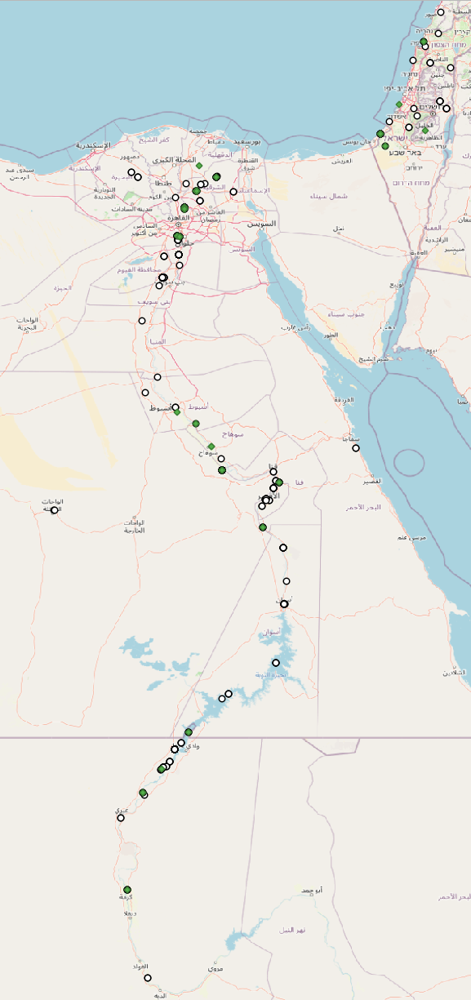

# Using Persons and Names of the Middle Kingdom SPARQL endpoint with QGIS

Since version 4, the Persons and Names of the Middle Kingdom dataset includes geographical coordinates of most places referred to in the database. 
These can be used in diverse applications, for example, one can map query results with GIS software. In this example, I use QGIS and a free SPARQL plugin for QGIS.

1. [QGIS](https://qgis.org/en/site/) and [SPARQLing Unicorn QGIS Plugin](https://github.com/sparqlunicorn/sparqlunicornGoesGIS) are both free multiplatform software.
2. SPARQLing Unicorn QGIS Plugin should be installed manually, because it is not yet an official plugin.
3. In SPARQLing Unicorn QGIS Plugin, you can add the Persons and Names of the Middle Kingdom SPARQL endpoint https://pnm.uni-mainz.de/sparql through "Quick Add RDF Resource" disabling the "detect namespaces" checkbox. 
An error message may be displayed, but the endpoint is still added.
4. With the Persons and Names of the Middle Kingdom SPARQL endpoint, you can execute queries, including geographical coordinates and put them on the map.
5. For example the following query returns Middle Kingdom name scarabs:
  ```sparql
   SELECT ?item ?lat ?lon  WHERE { 
  ?object <http://lawd.info/ontology/foundAt> ?place ; 
  <http://www.cidoc-crm.org/cidoc-crm/P128_carries> ?inscription ;
  <http://www.w3.org/2004/02/skos/core#prefLabel> ?item ; 
  <http://www.cidoc-crm.org/cidoc-crm/P2_has_type> / <http://www.w3.org/2004/02/skos/core#prefLabel> 'Scarab, seal, scaraboid, intaglio and similar objects'@en. 
  ?inscription ^ <http://www.cidoc-crm.org/cidoc-crm/P94_has_created> / crm:P117_occurs_during ?period .
  ?period <http://www.cidoc-crm.org/cidoc-crm/P9i_forms_part_of>* <https://pnm.uni-mainz.de/thesaurus/Middle%20Kingdom> .
  ?place <http://www.cidoc-crm.org/cidoc-crm/P168_place_is_defined_by> / <http://www.w3.org/2003/01/geo/wgs84_pos#lat> ?lat . 
  ?place <http://www.cidoc-crm.org/cidoc-crm/P168_place_is_defined_by> / <http://www.w3.org/2003/01/geo/wgs84_pos#long> ?lon . } 
 LIMIT 5000
   ```
And the following query does the same with Second Intermediate Period name scarabs.
   ```sparql
      SELECT ?item ?lat ?lon  WHERE { 
  ?object <http://lawd.info/ontology/foundAt> ?place ; 
  <http://www.cidoc-crm.org/cidoc-crm/P128_carries> ?inscription ;
  <http://www.w3.org/2004/02/skos/core#prefLabel> ?item ; 
  <http://www.cidoc-crm.org/cidoc-crm/P2_has_type> / <http://www.w3.org/2004/02/skos/core#prefLabel> 'Scarab, seal, scaraboid, intaglio and similar objects'@en. 
  ?inscription ^ <http://www.cidoc-crm.org/cidoc-crm/P94_has_created> / crm:P117_occurs_during ?period .
  ?period <http://www.cidoc-crm.org/cidoc-crm/P9i_forms_part_of>* <https://pnm.uni-mainz.de/thesaurus/SIP> .
  ?place <http://www.cidoc-crm.org/cidoc-crm/P168_place_is_defined_by> / <http://www.w3.org/2003/01/geo/wgs84_pos#lat> ?lat . 
  ?place <http://www.cidoc-crm.org/cidoc-crm/P168_place_is_defined_by> / <http://www.w3.org/2003/01/geo/wgs84_pos#long> ?lon . } 
 LIMIT 5000

```
6. The results can be combined with other GIS layers as follows (Middle Kingdom in white and the Second Intermediate Period in green)

